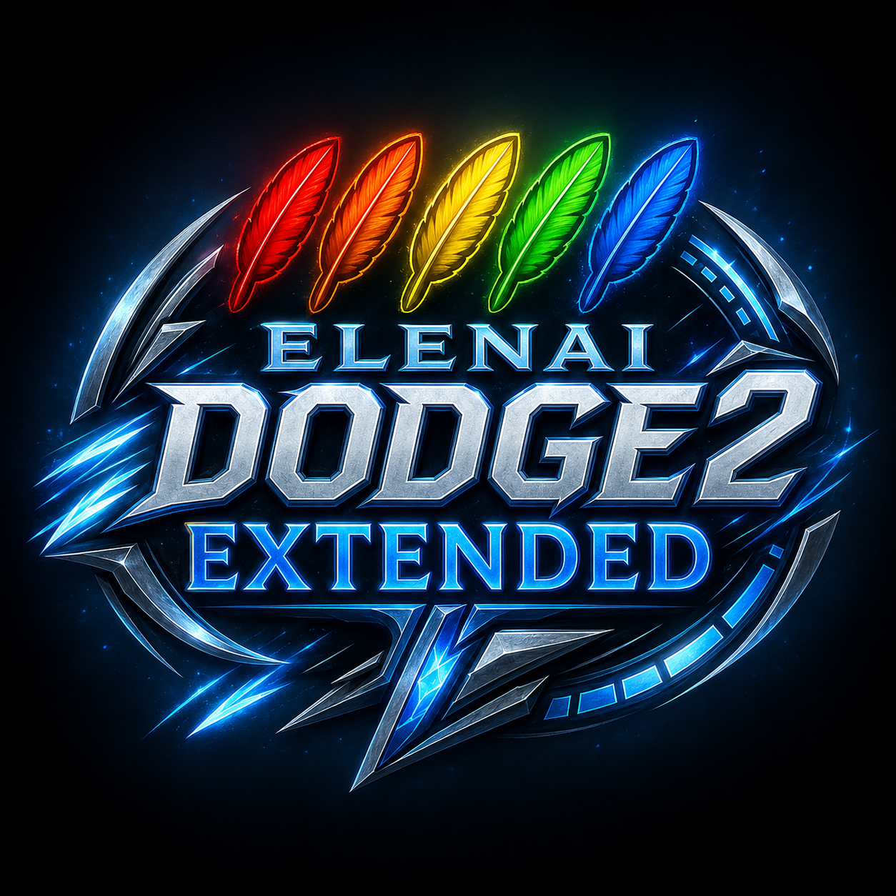

  

<h1 align="center">Elenai Dodge 2 Extended</h1>

  Unofficial extended fork of Elenai Dodge 2 for Minecraft Forge 1.12.2.

  
  
  
  
  

## About

This fork expands the original Minecraft 1.12.2 release with higher feather stamina, layered HUD feedback, server-side controls, lightweight dodge animations, and integration hooks for RPG-style systems.

It is intended for players, modpacks, and servers that still target Minecraft 1.12.2 and want an extended version of the original dodge system without moving to newer Minecraft versions.

This fork targets Minecraft 1.12.2 only. It is not intended to replace or backport the newer official Elenai Dodge 2 releases for later Minecraft versions. Future changes, if any, are planned to remain focused on Minecraft 1.12.2.

## Requirements

- Minecraft 1.12.2
- Minecraft Forge 14.23.5.2847 or compatible 1.12.2 environment
- Java 8

## Highlights

- Configurable base and maximum feather values.
- Layered feather rendering for higher stamina values.
- Feathery absorption scaling by potion level.
- Improved absorption feather display.
- Server-controlled dodge animations built with Minecraft Forge 1.12.2 client rendering hooks.
- First-person camera roll, particles, and sound tuning.
- Runtime server config reload with `/elenaiReload`.
- Updated feather GUI textures.

## Integration Hooks

The fork exposes hooks that other mods can use to adjust a player's effective feather limit and dodge cost. This is intended for RPG, race, class, attribute, equipment, or progression systems that need to influence dodge stamina without hardcoding those rules into this mod.

## Compatibility

The mod keeps the original `elenaidodge2` mod id for compatibility with existing registries, assets, potion IDs, and integration points.

## Credits

Original Elenai Dodge 2 mod by Elenai: https://github.com/ElenaiDev/ElenaiDodge2.0

Extended fork modifications by Shadow-Dickinson.

This fork is based on Elenai Dodge 2 for Minecraft 1.12.2. Changes were made to gameplay, HUD rendering, configuration sync, animation, assets, and integration hooks. This project is not an official release by Elenai and does not imply endorsement by the original author.

## License

This fork follows the license declared by the original project README: Creative Commons Attribution-NonCommercial-ShareAlike 3.0 Unported License.

The `LICENSE.txt`, `LICENSE-Paulscode IBXM Library.txt`, and `LICENSE-Paulscode SoundSystem CodecIBXM.txt` files preserve third-party license notices that were already present in the Minecraft 1.12.2 source tree. See `NOTICE.txt` for fork attribution, modification notes, and license details.
